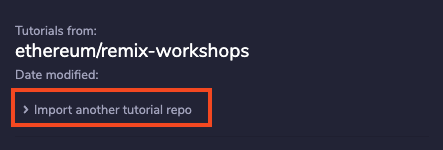

## Importing files

### Loading the default tutorials

The default tutorials created by the Remix team are loaded by default on first use.

Once you loaded another repository that will be loaded on startup instead of the default ones.

You can get back the default tutorials by using the import section.

There will be a dropdown. Select "ethereum/remix-workshops-master".

### Importing another repository

Open the import section.

Fill in the details of your github repo and click import.

The repo name is basically the url of the repository on github
but without github.com.

So this:

Becomes:

If you set up the repo correctly according to the steps outlined in <a href="setting_up_your_repository.html">Setting up your repository</a> you should be fine.
