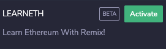

.. Learneth documentation master file, created by
   sphinx-quickstart on Tue Oct 27 10:49:14 2020.
   You can adapt this file completely to your liking, but it should at least
   contain the root `toctree` directive.

LearnEth plugin for Remix
=========================

About this plugin
-----------------

This plugin is used in the `Remix IDE <https://remix.ethereum.org/>`__. Remix is a powerful, open source tool that helps you write Solidity contracts straight from the browser. 
Read more about `Remix here <https://remix-ide.readthedocs.io/en/latest/index.html>`__.

By default the plugin provides step by step tutorials on how to *use the features of the Remix IDE*,
*code in the Solidity language* and many other topics related to it. 

The plugin also allows the user to experiment with code. The plugin is able to evaluate the user's input
and display answers and solutions to the assigments.

The plugin also allows anyone to **create new tutorials** to present to their audience.

The default tutorials
---------------------

By default the plugin loads its tutorials from a `Remix workshops repository <https://github.com/ethereum/remix-workshops>`__. 
It's a set created by the Remix team to get you started on a wide range of topics.

Creating tutorials
------------------

To create a new set of tutorials you will need to set up a new repository on github. You and your audience will then be able to import those tutorials
into the plugin. Follow these instructions to structure your repository correctly.

.. toctree::
   :maxdepth: 2

   setting_up_your_repository
   

Using the plugin
----------------

Read about the plugin interface and how to use it here.

.. toctree::
   :maxdepth: 2

   importing_files
   ui

Requirements
------------

Some tutorials need a set of Solidity plugins to be loaded into the IDE, otherwise testing your code is not possible.
On the home screen of the Remix IDE you will find a button to activate that set:

.. image:: assets/solidityplugin.png

Installation
------------

Go to the plugin manager using the button in the sidebar

.. image:: assets/pluginmanagerbutton.png

Find the LearnEth plugin the list and click 'activate'

Configuration
-------------

That's it, no configuration is needed. On the sidebar you will find the LearnEth icon. Click that to start the plugin.

