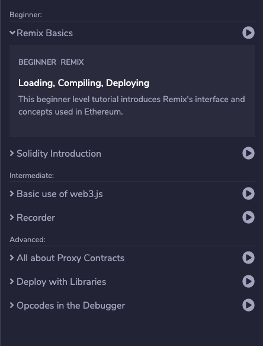

## Using tutorials

### The tutorial list

The plugin opens with a list of tutorials you can use.

They are grouped by the level of difficulty.

Each tutorial provides a short description of what it's for.

Click on the **play button** to start.

### Steps

Each tutorial consists of several steps you can go through.

### Loading files

Sometimes a step will load a file in the IDE.

It is best to check 'Remember this choice' so you only see this window once.

### Answers and checking answers

Sometimes a step contains a solution to the problem. It will be displayed on the right in the Remix IDE.

Sometimes a step contains a test. This will test the code you've written and display feedback.

You have an error in your code:

You have succeeded in the test:

### Navigation

* The home icon takes you back to the start
* The hamburger takes you to the list of steps in this tutorial
* Use the arrows to navigate to between steps
* Use the 'next' buttons to navigate to the next step

